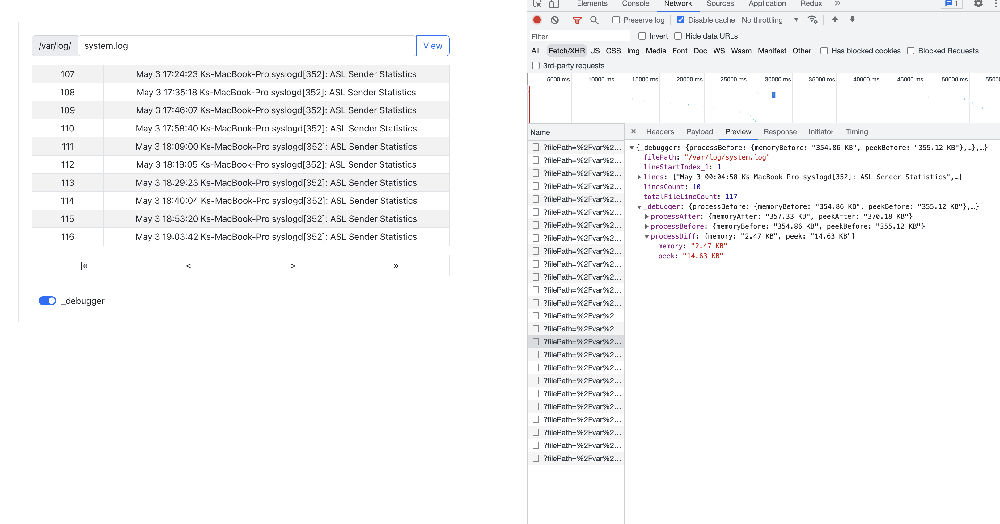
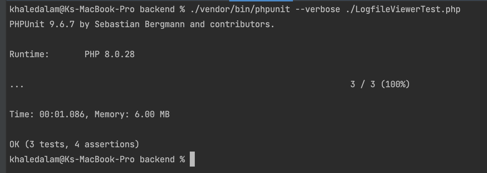
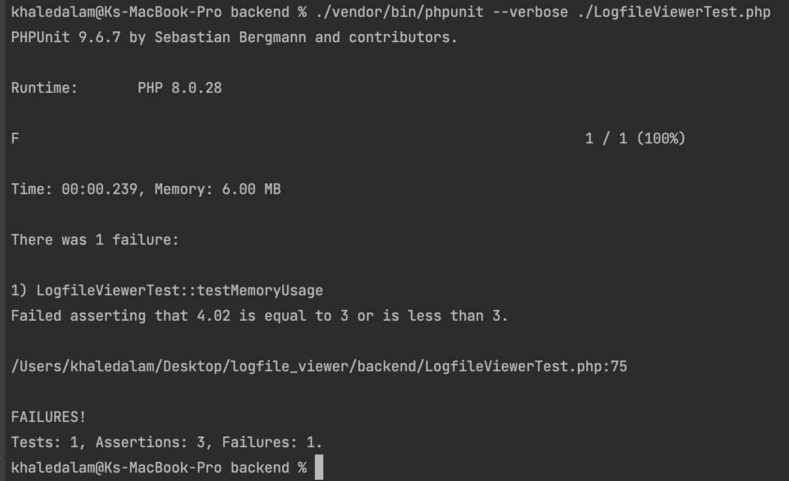
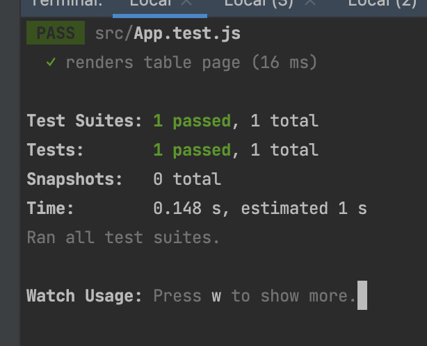
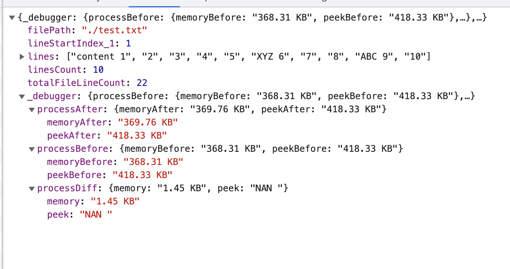

Running:
- backend: `cd backend && php -S localhost:8004 -t .`
- frontend: `cd ui && yarn run start`

navigate in browser: http://localhost:3000

Screenshots:

---
Testing:
- backend (phpUnit):
  - `cd backend && ./vendor/bin/phpunit --verbose ./LogfileViewerTest.php`
  - php testing server uses 8099 port
- frontend (jest): 
  - `cd ui && yarn run test`

---
Security:

- used simple Basic Auth:
  - depend on window.prompt and pre-call check_auth in frontend
  - hardcoded in index.php (class BasicAuth)
  
---

Performance:
- head & tail commands used, file with 100M lines (1.18 GB) `seq 100000000 > test.in` used memory "1.44 KB"

---

Others:
- [x] PHP v8.0.28 
- [x] React
- [x] add `_debugger` to response
- [x] Doc (phpDocumentor): `phpDocumentor -d ./backend -t docs`
- [x] [Enter] key trigger view file action
- [ ] handle if PHP testing server port is already in used
- [ ] unify Basic Auth of xhr to depend on headers as well instead of params
- [ ] `yarn run build` (prod.)
- [ ] add remain rules and tests
- [ ] dockerize app
- [ ] make filePath configurable to not be "under server log directory" only
- [ ] make page size configurable instead of hardcoded 10
- [ ] add searching & exporting functionalities
- [ ] etc..